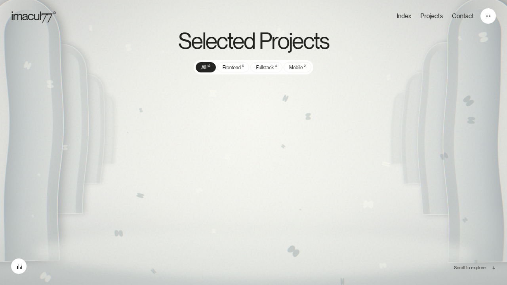

# IMACUL77 — Selected Projects

[](https://imacul77.vercel.app)
[](https://imacul77.vercel.app/admin/)

An immersive portfolio for **Emmanuel Oshakpemeh (IMACUL77)**, focused on frontend craft, fullstack systems, mobile products, and motion-led digital experiences.



## Highlights

- Liquid, architectural WebGL scene with a curved two-sided project gallery.
- Responsive project browsing with Frontend, Fullstack, and Mobile filters.
- Ambient sound with an explicit silent mode and reduced-motion fallback.
- Accessible image-grid fallback when WebGL is unavailable.
- Content managed from `content/site.json` through Decap CMS.

## Run locally

```bash
python -m http.server 4173 --bind 127.0.0.1
```

Open <http://127.0.0.1:4173/>.

## Content editing

Project cards, hero copy, entry screen text, footer links, and contact details live in [`content/site.json`](content/site.json). The private production repository includes Decap CMS at `/admin/`; the public showcase repository contains the same frontend source for review.

## Project structure

- `film.js` — WebGL scene, gallery mesh, refraction, and ambient motion.
- `motion.js` — project data, filters, dialogs, cursor interaction, and audio controls.
- `styles.css` — layout, typography, responsive behavior, and accessibility states.
- `admin/` — Decap CMS configuration and editor shell.
- `assets/logo-imacul.svg` — IMACUL77 monogram favicon and brand mark.

## Credits

The visual direction was studied from [Unseen Studio’s Projects page](https://unseen.co/projects/). The architectural scene, gallery renderer, and refraction shader are original implementation work. The bundled font and ambience file are documented in the source repository.
